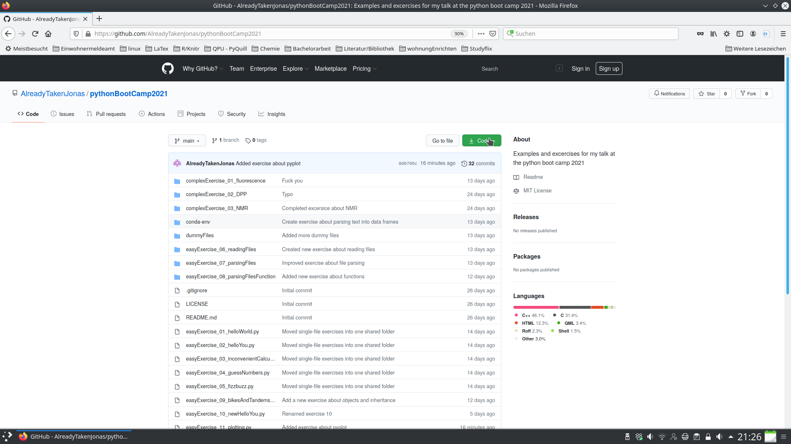
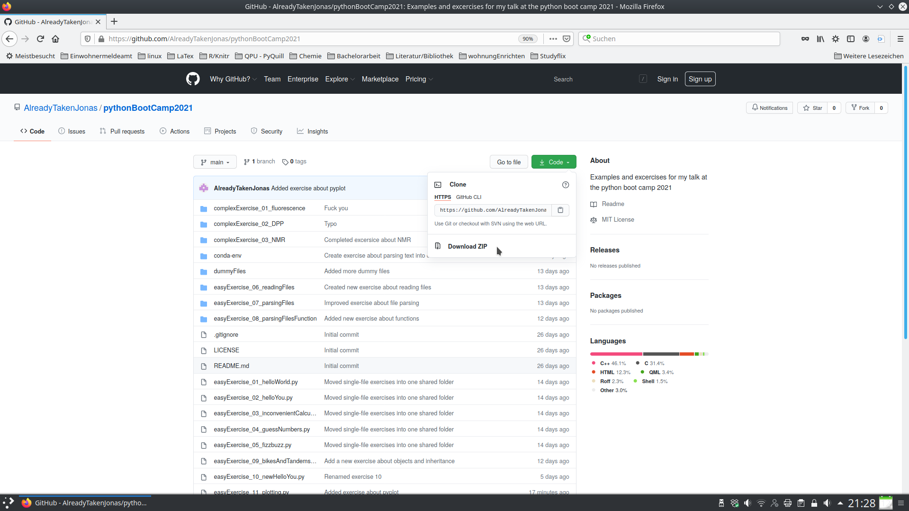
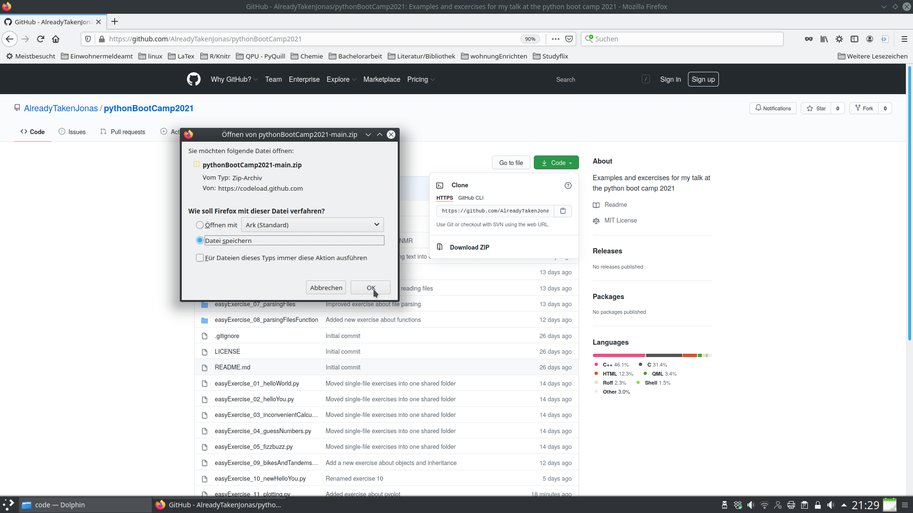

# Examples and Exercises for the Python Bootcamp 2021

This github repository contains the solutions to the exercises and some example code for the talk. Some of the exercises use files with experimental data or just some arbitrary data for experimenting with python. 
You might want to download this repository and use the data files. You can find them in the folders dummyFiles and the folders of the exercises. Follow these images in order to download the repository.

1. Click on "Code"

2. Click on "Download ZIP"

3. Save the repository

